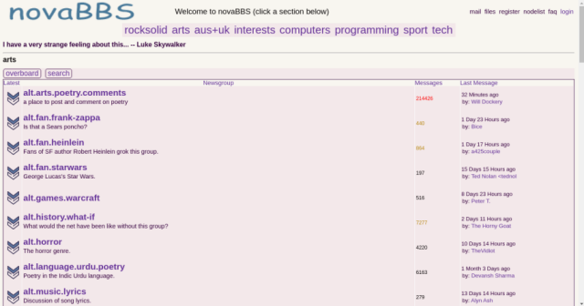

Rocksolid Light (rslight) - a web based Usenet news client

Visit https://www.novabbs.com to try Rocksolid Light

[Screenshots](Rocksolid_Light/archive/screenshots)

Rocksolid Light is based on NewsPortal, which discontinued development in 2008, and was
developed by Florian Amrhein https://florian-amrhein.de/newsportal/

rslight contains some major code and feature changes, but would not exist
without NewsPortal as a basis for development.

Rocksolid Light is a php web forum interface that basically uses nntp as a backend.
Forums can be Usenet newsgroups, or any groups you wish to create. Forums can be
synchronized with other rslight installs, or other nntp servers.

  * Uses sqlite3 database. No configuration required
  * Does not require Javascript
  * Built in nntp server
  * Synchronize with inn or another rslight site, or run standalone
  * Read and post using a news client
  * SSL encryption
  * Tested with Claws Mail, Thunderbird, Knews, tin, Pan and some others
  * NoCeM and Spamassassin support
  * Message expiration by site or by group
  * Send/Receive mail to/from users at other Rocksolid Light sites
  * Search article bodies
  * Display body snippet in overboard and search results
  * Email authentication if enabled
  * Protect poster email addresses if enabled
  * Interface works reasonably well on small devices
  * Colors in CSS are in a separate file for easy testing and modification
  * Groups can be renamed for cleaner display
  * Configuration options may be set for each individual 'section'

## Installation

See INSTALL.md for installation instructions.

## Support & Community

If you have trouble, post to rocksolid.nodes.help (www.novabbs.com) and we'll try to help.

[rocksolid-light Community Repository on Github](https://github.com/go-while/rocksolid-light)

## In Memory of Retro Guy

**Thomas "Thom" Miller (Retro Guy)** - *Creator and Lead Developer*
*Passed away April 26, 2025*

Thom was the visionary behind RockSolid Light, transforming NewsPortal into a modern, robust newsgroup platform that serves communities worldwide. His excellent defensive programming practices, fault-tolerant architecture, and dedication to preserving internet infrastructure have left an indelible mark on the open source community.

This project continues in his honor, maintaining and modernizing his exceptional work for future generations of newsgroup enthusiasts.

*"The internet never forgets, and neither will we."*

## Current Maintainers

The RockSolid Light project is now maintained by the community, ensuring Thom's legacy continues to serve newsgroup users around the world.

For development updates and PHP 8.2 compatibility improvements, see [CHANGELOG.md](CHANGELOG.md).

---
